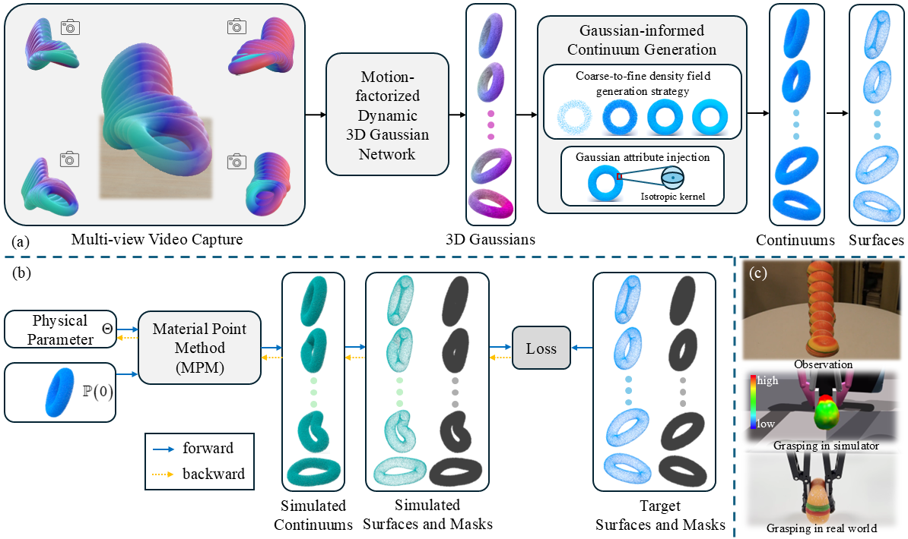

<div align="center">

## Gaussian-Informed Continuum for Physical Property Identification and Simulation (NeurIPS 2024 Oral)

[Junhao Cai](https://caijunhao.github.io/)<sup>1*</sup>, [Yuji Yang](https://jukgei.github.io/)<sup>2*</sup>, [Weihao Yuan](https://weihao-yuan.com/)<sup>3†</sup>, [Yisheng He](https://hyshkust.github.io/)<sup>3</sup>, [Zilong Dong](https://scholar.google.co.uk/citations?user=GHOQKCwAAAAJ&hl=en)<sup>3</sup>, [Liefeng Bo](https://research.cs.washington.edu/istc/lfb/)<sup>3</sup>, [Hui Cheng](https://cse.sysu.edu.cn/content/2504)<sup>2</sup>, [Qifeng Chen](https://cqf.io)<sup>1</sup>

<p><sup>1</sup>The Hong Kong University of Science and Technology, &nbsp;&nbsp;<sup>2</sup>Sun Yat-sen University, &nbsp;&nbsp;<sup>3</sup>Alibaba Group &nbsp;&nbsp;
<br><sup>*</sup>Equal contribution, order determined by coin toss. &nbsp;&nbsp;
<br><sup>†</sup>Corresponding author &nbsp;&nbsp;
<br>Accepted at Conference on Neural Information Processing Systems, 2024 (Oral) &nbsp;&nbsp;

[Project Page](https://jukgei.github.io/project/gic) | [Paper](https://arxiv.org/pdf/2406.14927)
</div>




### Environment
The code has been tested on `Ubuntun 22.04` with `CUDA Tookit 12.1`. Please ensure that you have correctly installed the `CUDA Toolkit 12.1` before running the following commands to install the remaining dependencies.
```bash
git clone https://github.com/Jukgei/gic
cd gic

conda env create --file environment.yml
conda activate gic
```

### Dataset
We used the same segmentation [model](https://ucla.app.box.com/s/039jwttn9ibac73h3kit5vsuiepy7j4y) as PAC-NeRF for segmentation. We validated our algorithm using the [PAC-NeRF](https://xuan-li.github.io/PAC-NeRF/) [dataset](https://ucla.app.box.com/s/039jwttn9ibac73h3kit5vsuiepy7j4y) and the [Spring-Gaus](https://zlicheng.com/spring_gaus/) [dataset](https://drive.google.com/drive/folders/1SN4vrPZSuBnbkDTLl0nu9g-boVUr5yO1).

The structure of the dataset and model files in the root directory is as follows:

```
├── data
│   | checkpoint
│     ├── pytorch_resnet101.pth
│   | pacnerf
│     ├── bird
│     ├── cat
│     ├── ...
│   | sgs
│     ├── apple
│     ├── C
│     ├── cream
│     ├── ...
```

### Segmentation
If you're running it for the first time, you need to perform foreground-background segmentation on the dataset first.
```
python prepare_pacnerf_data.py --data_folder=data/pacnerf/torus
```

### Training

```
python train_dynamic.py -c config/pacnerf/torus.json -s data/pacnerf/torus -m output/pacnerf/torus --reg_scale --reg_alpha
```
The results of the parameter estimation and the related settings will be saved in the `{config_id}-pred.json` file located in the `output/pacnerf/torus` directory.


### Application
After estimating the parameters, we can modify different materials or physical parameters (such as gravity, Young's modulus, etc.) to generate new videos. For example, For example, we change the Young's modulus of the torus.


```
python new_trajectory.py -c config/predict/elastic.json -s data/pacnerf/torus -m output/pacnerf/torus -vid 3 -cid 0 --reg_alpha
```

Command-Line Arguments Explanation
- vid: camera id.

- cid: estimated result file id.

The new video `output.mp4` will be generated in the `output/pacnerf/torus` directory.


### Acknowledgments
We sincerely thank the authors of [Deformable Gaussians](https://ingra14m.github.io/Deformable-Gaussians/), [PAC-NeRF](https://xuan-li.github.io/PAC-NeRF/), [Spring-Gaus](https://zlicheng.com/spring_gaus/), whose codes and datasets were used in our work. 


### BibTex
```
@article{cai2024gaussian,
  title={Gaussian-Informed Continuum for Physical Property Identification and Simulation},
  author={Cai, Junhao and Yang, Yuji and Yuan, Weihao and He, Yisheng and Dong, Zilong and Bo, Liefeng and Cheng, Hui and Chen, Qifeng},
  journal={Advances in Neural Information Processing Systems},
  year={2024}
}
```


